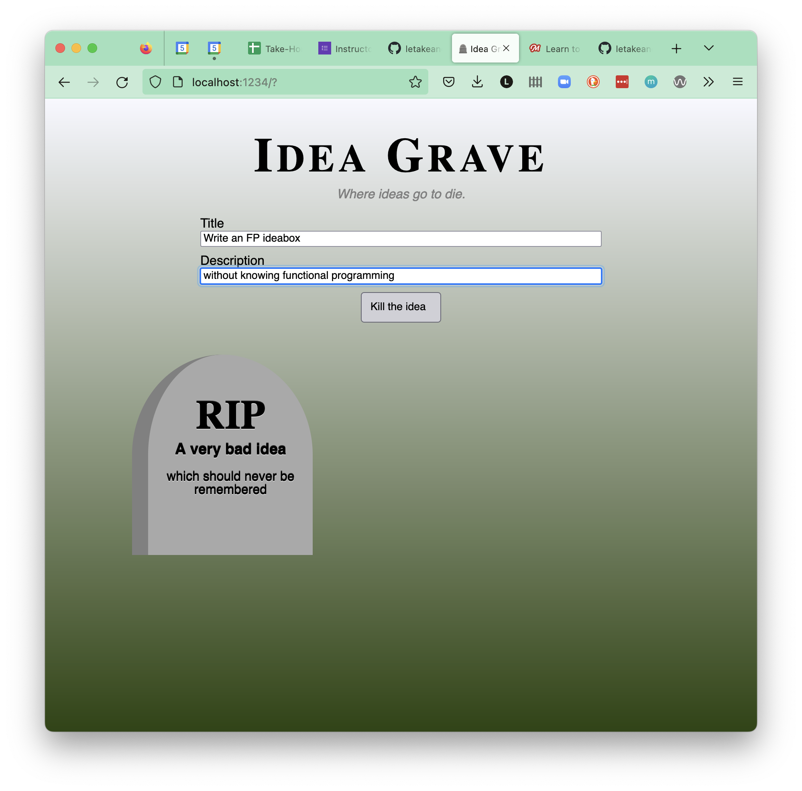

# IdeaGrave

A graveyard for ideas.

This project is intended as solo practice in learning Functional Programming (after coming from a background of OOP).

## Setup

1. Fork and clone
1. Install dependencies (`npm i`)
1. Start up the parcel server using `npm start`
1. Navigate to `localhost:1234` in your browser to view.

## View

## Takeaways & Questions

At this point, I still have way more questions than takeaways, but here's what I've gleaned thus far:

- Whenever possible, create copies of data rather than mutating them.
  - In this app, rather than pushing a new idea into the ideas array directly, I used map to create a copy, pushed into the copy, and then reassigned the original `ideas` variable to the copy.
- Break functionality into individual steps
  - I created several functions to execute individual steps. 
  - Then the functions are composed to execute a complex task.
  - An example of this is in `handleSubmit` on line 41.

Questions:
- Is this functional???????? That's the big one lol
- Touching the DOM feels non-functional and full of possible side effects
  - How do we interact with the DOM as functionally as possible?
- I replicated a pipelining function but can't figure out how to use it to replace line 41
  - The tripping point is the need for the two `retrieveData` calls, one for the title input and one for the description input.
  - Is it better to refactor the `retrieveData` function to handle both at once, combining with the `makeIdea` function?
  - Or is it better to leave it as is, and to adjust the `pipelining` function?

## To Dos

~~1. Break `index.js` into multiple files~~
  ~~1. Move DOM functionality into its own file~~
  ~~1. Move data model manipulation into its own file~~
~~1. Create getters and setters for `ideas` and a singular `idea`~~
~~1. Wrap functionality in a function~~
1. Move query selectors into functions